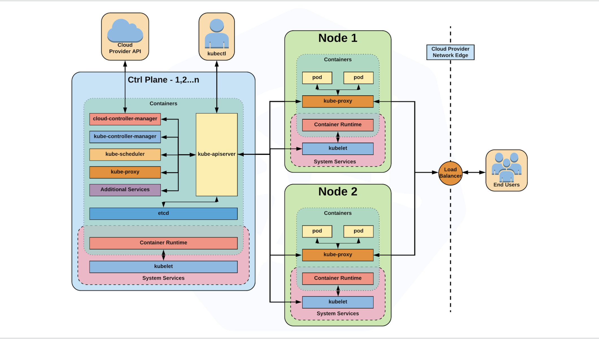

# Architecture Overview

## What can Kubernetes REALLY do?

- Autoscale workloads
- Perform roll forwards and rollbacks with deployments
- Trigger jobs and scheduled cronjobs
- Manage stateless and stateful applications
- Provide native service discovery methods
- Integrate and support third-party applications easily

## Control Plane Components

- **kube-apiserver**
- **etcd**
- **kube-controller-manager**
- **kube-scheduler**
- **cloud-controller-manager**
### kube-apiserver

- Provides a RESTful interface to the Kubernetes control plane and datastore.
- Serves as the main entry point for all clients and applications interacting with the cluster.
- Handles authentication, authorization, request validation, mutation, and admission control.
- Acts as the gatekeeper, ensuring only valid and authorized requests reach the cluster.
- Functions as the front-end to the underlying datastore.

### etcd
- Acts as the cluster's datastore.
- Provides a strong, consistent, and highly available key-value store for persisting cluster state.
- Stores objects and configuration information.
- Ensures reliable storage and retrieval of all Kubernetes resource data.
- Facilitates leader election and coordination among control plane components.

### kube-controller-manager

- Monitors the cluster state via the kube-apiserver and ensures the cluster matches the desired state.
- **Node Controller:** Detects and responds when nodes become unavailable.
- **Replication Controller:** Maintains the correct number of pod replicas for each replication controller object.
- **Endpoints Controller:** Updates Endpoints objects to link Services with their corresponding Pods.
- **Service Account & Token Controllers:** Automatically create default service accounts and API access tokens for new namespaces.

### kube-scheduler

- Watches for newly created pods that do not yet have a node assigned.
- Selects an appropriate node for each pod to run on.
- Considers factors such as:
    - Resource requirements (CPU, memory, etc.)
    - Hardware, software, and policy constraints
    - Affinity and anti-affinity rules
    - Data locality
    - Inter-workload interference
    - Scheduling deadlines
- Ensures efficient and balanced pod placement across the cluster.

### cloud-controller-manager

- **Node Controller:** Checks with the cloud provider to determine if a node has been deleted in the cloud after it stops responding.
- **Route Controller:** Sets up network routes in the underlying cloud infrastructure.
- **Service Controller:** Creates, updates, and deletes cloud provider load balancers.
- **Volume Controller:** Manages the creation, attachment, and mounting of volumes, and interacts with the cloud provider to orchestrate volumes.

## Node Components

- **kubelet**: An agent that runs on each node in the cluster. It ensures that containers are running in a Pod by communicating with the control plane and managing the lifecycle of containers.
- **kube-proxy**: Maintains network rules on nodes, enabling communication to Pods from inside or outside the cluster. It handles request forwarding and load balancing for services.
- **Container Runtime Engine**: The software responsible for running containers (e.g., containerd, Docker, CRI-O). It pulls container images, starts containers, and manages their execution on the node.
