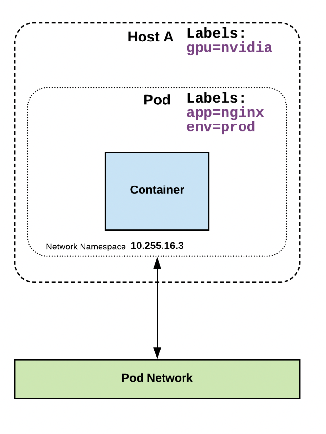
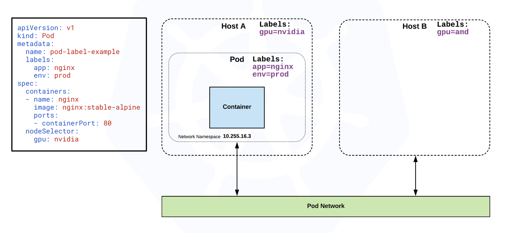

# Core Objects

- Namespaces
- Pods
- Labels
- Selectors
- Services

### Namespaces

In Kubernetes, namespaces provide a mechanism for isolating groups of resources within a single cluster. Names of resources need to be unique within a namespace, but not across namespaces.

#### Initial namespaces

- default
- kube-node-lease
- kube-public
- kube-system

```sh
kubectl get namespace

kubectl run nginx --image=nginx --namespace=<insert-namespace-name-here>
kubectl get pods --namespace=<insert-namespace-name-here>

kubectl config set-context --current --namespace=<insert-namespace-name-here>
# Validate it
kubectl config view --minify | grep namespace:

kubectl create namespace <insert-namespace-name-here>

kubectl delete namespaces <insert-some-namespace-name>
```

**Warning:**  
This deletes everything under the namespace!

## Labels




key-value pairs that are used to identify, describe and group together related sets of objects or resources. 


## Selectors



Selectors use labels to filter or select objects, and are used throughout Kubernetes.