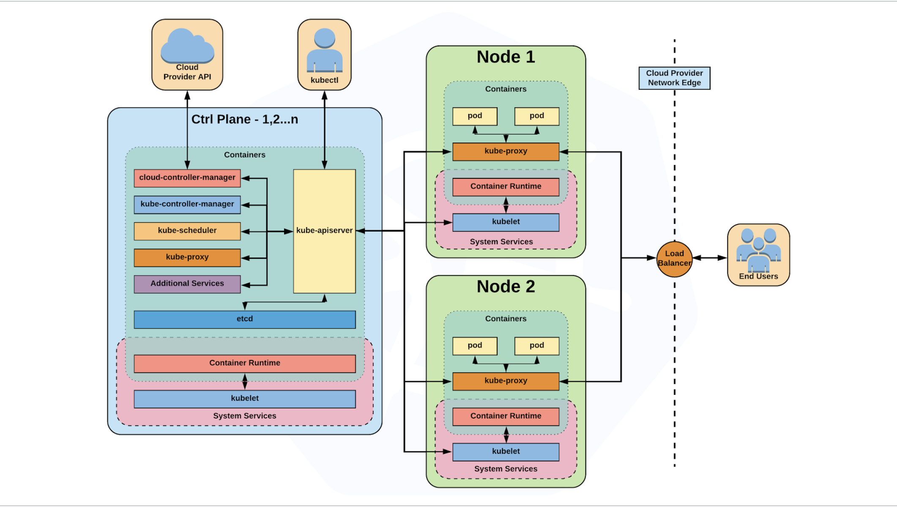

# Architecture Overview

## What can Kubernetes REALLY do?

- Autoscale workloads
- Perform roll forwards and rollbacks with deployments
- Trigger jobs and scheduled cronjobs
- Manage stateless and stateful applications
- Provide native service discovery methods
- Integrate and support third-party applications easily

## Control Plane Components

- **kube-apiserver**
- **etcd**
- **kube-controller-manager**
- **kube-scheduler**
- **cloud-controller-manager**
### kube-apiserver

- Provides a RESTful interface to the Kubernetes control plane and datastore.
- Serves as the main entry point for all clients and applications interacting with the cluster.
- Handles authentication, authorization, request validation, mutation, and admission control.
- Acts as the gatekeeper, ensuring only valid and authorized requests reach the cluster.
- Functions as the front-end to the underlying datastore.

### etcd
- Acts as the cluster's datastore.
- Provides a strong, consistent, and highly available key-value store for persisting cluster state.
- Stores objects and configuration information.
- Ensures reliable storage and retrieval of all Kubernetes resource data.
- Facilitates leader election and coordination among control plane components.

